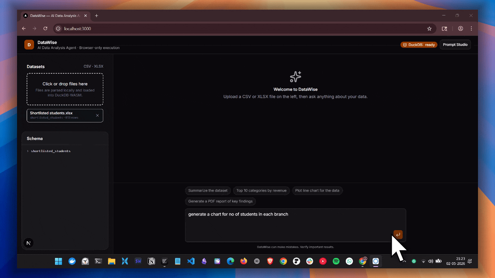
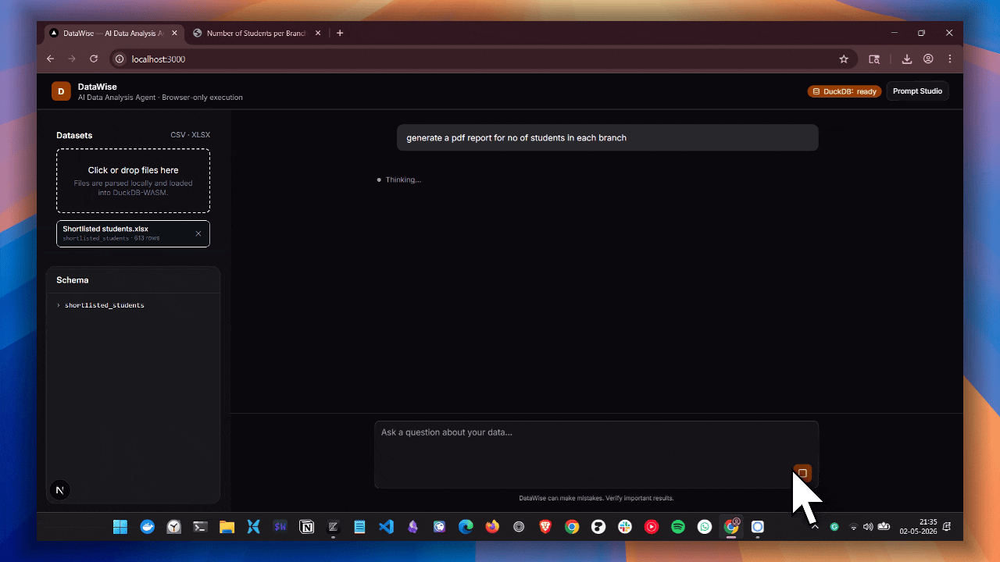
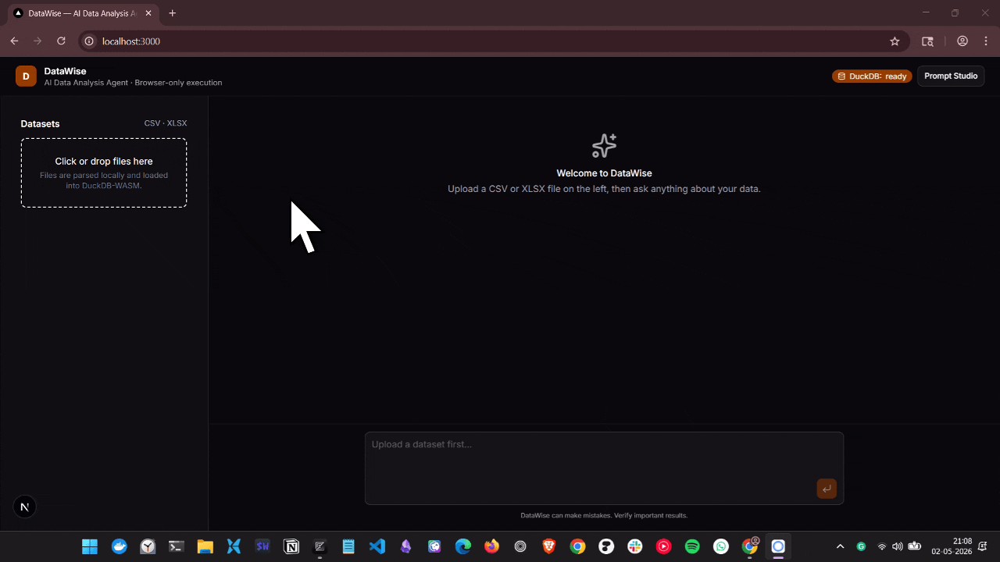

<h1 align="center">DataWise</h1>

> An AI-powered data analysis agent that runs entirely in your browser. Upload a CSV or XLSX, ask questions in plain English, and get answers, charts, and PDF reports, all generated by an LLM and executed client-side.

## 🚀 Features

- **Browser-only execution.** SQL queries run in DuckDB-WASM. Charts and PDFs run in sandboxed Sandpack iframes. The server never touches your data.
- **Natural-language data analysis.** Ask "Top 10 categories by revenue" or "What's the trend?" and the agent writes and runs the SQL for you.
- **Dynamic D3 charts.** The agent generates fresh D3.js code for every chart — no hardcoded templates.
- **Downloadable PDF reports.** Generated with `jsPDF` inside a hidden Sandpack iframe, delivered via `postMessage`.
- **Live prompt editing.** Tweak the agent's system prompts at `/prompt-studio` without restarting.
- **Pluggable LLM.** Swap Nvidia NIM / Google Gemini for OpenAI / Anthropic in one file (`ai-models.ts`).

## 🌺 Tech Stack

- **Frontend:** Next.js 16 · React 19 · AI SDK UI (`@ai-sdk/react`) · DuckDB-WASM · Sandpack · Tailwind CSS v4
- **Backend:** Hono · AI SDK v6 (`streamText`, `tool`, `convertToModelMessages`)
- **LLM:** Google Gemini (default) — swappable via `ai-models.ts`

## ✅ DataWise in Action

> Pototype Build in Action

> kindly wait for a sec to load the demo...

#### Generating Charts (intercative charts)

<div align="center">
  
</div>

#### Generating PDF Report

<div align="center">
  
</div>

#### Normal Data Analysis

<div align="center">
  
</div>

## 🏗️ Architectural Diagram

```md
╔══════════════════════════════════════════════════════════════════════════════╗
║                  DATAWISE — AI DATA ANALYSIS AGENT                           ║
║                       Architecture Overview                                  ║
╚══════════════════════════════════════════════════════════════════════════════╝


                                  ┌──────────┐
                                  │   USER   │
                                  └─────┬────┘
                                        │  uploads CSV/XLSX · types question
                                        ▼
┌─────────────────────────────────────────────────────────────────────────────┐
│                       BROWSER  (Next.js + React)                            │
│                                                                             │
│   ┌──────────────┐    ┌────────────────┐    ┌────────────────────────┐      │
│   │ File Upload  │───▶│  parse-file    │───▶│      DuckDB-WASM       │      │
│   │ (CSV / XLSX) │    │ Papa / SheetJS │    │  (Worker · in-browser) │      │
│   └──────────────┘    └────────────────┘    │  CREATE TABLE · QUERY  │      │
│                                             └───────────┬────────────┘      │
│                                                         │                   │
│   ┌─────────────────────────────────────────────────────▼────────────┐      │
│   │                    useChat   (AI SDK v6)                         │      │
│   │                                                                  │      │
│   │   sends: messages + datasetContext (schema + samples)            │      │
│   │   onToolCall:                                                    │      │
│   │     • execute_query  ──▶  runs SQL on DuckDB-WASM                │      │
│   │                            sends rows back via addToolOutput     │      │
│   │   renders message.parts[] (text + typed tool parts)              │      │
│   └────┬─────────────────────────────────────────────────────────────┘      │
│        │                                                                    │
│        │  tool outputs from server                                          │
│        ▼                                                                    │
│   ┌──────────────────────────┐    ┌──────────────────────────────┐          │
│   │   Chart Renderer         │    │   PDF Renderer (hidden)      │          │
│   │   Sandpack (visible)     │    │   Sandpack + postMessage     │          │
│   │   runs LLM's D3 code     │    │   runs LLM's jsPDF code      │          │
│   │   → inline SVG chart     │    │   → blob → auto-download     │          │
│   └──────────────────────────┘    └──────────────────────────────┘          │
│                                                                             │
└─────────────────────────────┬───────────────────────────────────────────────┘
                              │  HTTP  (POST /api/chat · SSE stream back)
                              ▼
┌─────────────────────────────────────────────────────────────────────────────┐
│                         SERVER  (Hono + Node)                               │
│                                                                             │
│   POST /api/chat                                                            │
│       │                                                                     │
│       ▼                                                                     │
│   ┌──────────────────────────────────────────────────────────────┐          │
│   │              streamText  (AI SDK v6)                         │          │
│   │   model: models.agent       ◀─── from ai-models.ts           │          │
│   │   system: prompts.mainAgent + datasetContext                 │          │
│   │   tools:                                                     │          │
│   │     ┌──────────────────────────────────────────────────┐     │          │
│   │     │ execute_query        (no execute → CLIENT runs)  │     │          │
│   │     │ generate_svg_chart   (server execute → codegen)  │     │          │
│   │     │ generate_pdf_report  (server execute → codegen)  │     │          │
│   │     └──────────────────────────────────────────────────┘     │          │
│   │   stopWhen: stepCountIs(8)                                   │          │
│   │   → toUIMessageStreamResponse()                              │          │
│   └──────────────────────────────────────────────────────────────┘          │
│                              │                                              │
│                              │ when chart/PDF tool runs                     │
│                              ▼                                              │
│   ┌──────────────────────────────────────────────────────────────┐          │
│   │                isolated generateText call                    │          │
│   │   model: models.chartCodegen / models.pdfCodegen             │          │
│   │   system: prompts.d3Skills / prompts.pdfSkills               │          │
│   │   → returns code string (D3 / jsPDF) → tool output           │          │
│   └──────────────────────────────────────────────────────────────┘          │
│                                                                             │
│   GET/PUT /api/prompts        (in-memory prompt editing)                    │
│   GET     /api/health         (which models are active)                     │
│                                                                             │
└──────────────┬──────────────────────────────────────────────────────────────┘
               │
               ▼
┌─────────────────────────────────────────────────────────────────────────────┐
│                            LLM PROVIDER                                     │
│                                                                             │
│        ai-models.ts  →  Google Gemini  /  OpenAI  /  Anthropic              │
│                         (one line to swap per role)                         │
│                                                                             │
└─────────────────────────────────────────────────────────────────────────────┘


────────────────────────────── KEY FLOWS ──────────────────────────────────────

  TEXT-ONLY ANSWER
    user ─▶ useChat ─▶ /api/chat ─▶ streamText ─▶ LLM ─▶ stream ─▶ UI

  DATA QUESTION (client tool)
    user ─▶ LLM picks execute_query ─▶ stream tool call to browser
         ─▶ onToolCall runs SQL on DuckDB-WASM
         ─▶ addToolOutput(rows) ─▶ auto-resume ─▶ LLM summarizes ─▶ UI

  CHART (server tool)
    LLM picks generate_svg_chart ─▶ server isolated LLM call (D3 codegen)
         ─▶ code string streamed to browser
         ─▶ Sandpack mounts code ─▶ inline SVG rendered

  PDF (server tool)
    LLM picks generate_pdf_report ─▶ server isolated LLM call (jsPDF codegen)
         ─▶ code string streamed to browser
         ─▶ hidden Sandpack runs ─▶ postMessage(blob) ─▶ download

```

## 📖 Prerequisites

- **Node.js 20+**
- **pnpm** (or npm / yarn — adapt commands accordingly)
- **A Nvidia NIMS API key** — get one free at [Nvidia NIM](https://build.nvidia.com/nvidia/nemotron-3-super-120b-a12b)

## ⚡ Run on your machine

The client and server run independently. Open two terminals.

### 1. Server

```bash
cd server
cp .env.example .env
# edit .env and set NVIDIA_NIM_API_KEY=...
pnpm install
pnpm dev
```

Server runs on **http://localhost:8787**.

### 2. Client

```bash
cd client
pnpm install
pnpm dev
```

Client runs on **http://localhost:3000**.

## Environment Variables

### `server/.env`

```bash
# Required for whichever provider you use
NVIDIA_NIM_API_KEY=your_nvidia_nmi_api_key
# OPENAI_API_KEY=your_openai_api_key

PORT=8787
```

### `client/.env.local` *(optional)*

```bash
NEXT_PUBLIC_API_URL=http://localhost:8787
```

## Usage

1. Open http://localhost:3000.
2. Click the upload area in the sidebar and drop a CSV or XLSX file.
3. Wait for "DuckDB: ready" and the schema to appear.
4. Ask things like:
   - *"Summarize the dataset"*
   - *"Top 10 categories by revenue"*
   - *"Plot monthly sales as a line chart"*
   - *"Generate a PDF report of key findings"*

The agent decides which tools to use:

| Question type                 | Tool used              | Where it runs                        |
| ----------------------------- | ---------------------- | ------------------------------------ |
| Schema / metadata             | none — answers inline  | —                                    |
| Aggregations, filters, joins  | `execute_query`        | DuckDB-WASM in your browser          |
| "Show / plot / chart"         | `generate_svg_chart`   | Sandpack iframe (D3.js)              |
| "Report / PDF / export"       | `generate_pdf_report`  | Hidden Sandpack iframe (jsPDF)       |

## Swapping the LLM

All model selection lives in **`server/src/ai-models.ts`**:

```ts
import { google } from '@ai-sdk/google';
// import { openai } from '@ai-sdk/openai';
// import { anthropic } from '@ai-sdk/anthropic';

export const models = {
  agent:        google('gemini-2.5-pro'),  // main chat / tool loop
  chartCodegen: google('gemini-2.5-pro'),  // D3 code generation
  pdfCodegen:   google('gemini-2.5-pro'),  // jsPDF code generation
};
```

Edit any line to point a role at a different model or provider:

```ts
agent:        openai('gpt-5-mini'),
chartCodegen: google('gemini-2.5-flash'),
pdfCodegen:   anthropic('claude-sonnet-4-5'),
```

To add a new provider: `pnpm add @ai-sdk/<provider>` in `server/`, import it, and use it.

## Editing Prompts

Three prompts power the agent — all stored **in-memory** on the server:

| Key          | Purpose                                                       |
| ------------ | ------------------------------------------------------------- |
| `mainAgent`  | The system prompt that decides when to use tools.             |
| `d3Skills`   | Strict output contract for the D3 chart code generator.       |
| `pdfSkills`  | Strict output contract for the jsPDF report code generator.   |

Edit them live at **http://localhost:3000/prompt-studio**. Changes apply on the next chat request and reset on server restart.


## 📂 Folder Structure

```txt
.
├── client
│   ├── components.json
│   ├── eslint.config.mjs
│   ├── next.config.ts
│   ├── next-env.d.ts
│   ├── package.json
│   ├── pnpm-lock.yaml
│   ├── pnpm-workspace.yaml
│   ├── postcss.config.mjs
│   ├── public
│   │   ├── file.svg
│   │   ├── globe.svg
│   │   ├── next.svg
│   │   ├── vercel.svg
│   │   └── window.svg
│   ├── README.md
│   ├── src
│   │   ├── app
│   │   │   ├── favicon.ico
│   │   │   ├── globals.css
│   │   │   ├── layout.tsx
│   │   │   ├── page.tsx
│   │   │   └── prompt-studio
│   │   │       └── page.tsx
│   │   ├── components
│   │   │   ├── ai-elements
│   │   │   │   ├── agent.tsx
│   │   │   │   └── *******
│   │   │   ├── chart-render
│   │   │   │   ├── chart-content.tsx
│   │   │   │   ├── chart-loader.tsx
│   │   │   │   ├── chart-renderer.tsx
│   │   │   │   └── iframe-response.ts
│   │   │   ├── chart-renderer-v0.tsx
│   │   │   ├── chart-renderer-v1.tsx
│   │   │   ├── file-upload.tsx
│   │   │   ├── message.tsx
│   │   │   ├── message-v0.tsx
│   │   │   ├── pdf-renderer.tsx
│   │   │   ├── pdf-renderer-v0.tsx
│   │   │   └── ui
│   │   │       ├── alert.tsx
│   │   │       ├── ********
│   │   ├── hooks
│   │   │   └── use-duckdb.ts
│   │   ├── lib
│   │   │   ├── parse-file.ts
│   │   │   └── utils.ts
│   │   └── utils
│   │       └── escape-html.ts
│   └── tsconfig.json
├── README.md
└── server
    ├── package.json
    ├── pnpm-lock.yaml
    ├── pnpm-workspace.yaml
    ├── src
    │   ├── ai-models.ts
    │   ├── index.ts
    │   ├── prompts.ts
    │   ├── skills-prompts
    │   │   ├── d3_skills.ts
    │   │   ├── main_skills.ts
    │   │   └── pdf_skills.ts
    │   └── tools.ts
    └── tsconfig.json
```

## License

MIT
